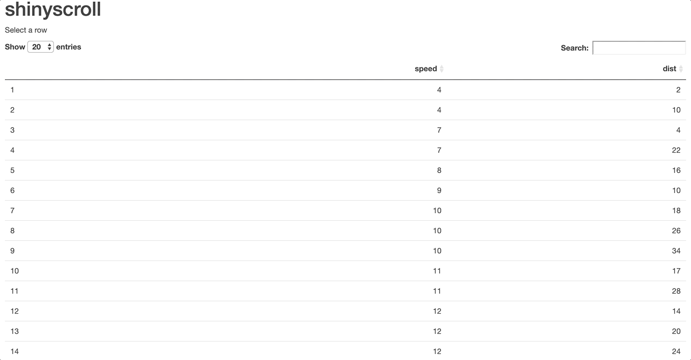

<!-- badges: start -->
<!-- badges: end -->

# shinyscroll

Programatically scroll in Shiny.

## Installation

Install it with `remotes` from Github:

``` r
# install.packages("remotes")
remotes::install_github("JohnCoene/shinyscroll")
```

## Example

{shinyscroll} was created to solve the use case below, where I want the window to scroll to a plot dynamically created by a click in a DT table.

``` r
library(DT)
library(shiny)
library(shinyscroll)

ui <- fluidPage(
  use_shinyscroll(),
  h1("shinyscroll"),
  p("Select a row"),
  DTOutput("table"),
  plotOutput("plot")
)

server <- function(input, output, session){

  output$table <- renderDT({
    datatable(cars, selection = "single", options = list(pageLength = 20L))
  })

  dataset <- eventReactive(input$table_rows_selected, {
    scroll("plot") # scroll to plot
    runif(100)
  })

  output$plot <- renderPlot(plot(dataset()))
}

shinyApp(ui, server)
```



It's also used in the DXY tab of the [coronavirus tracker](http://shiny.john-coene.com/coronavirus)
